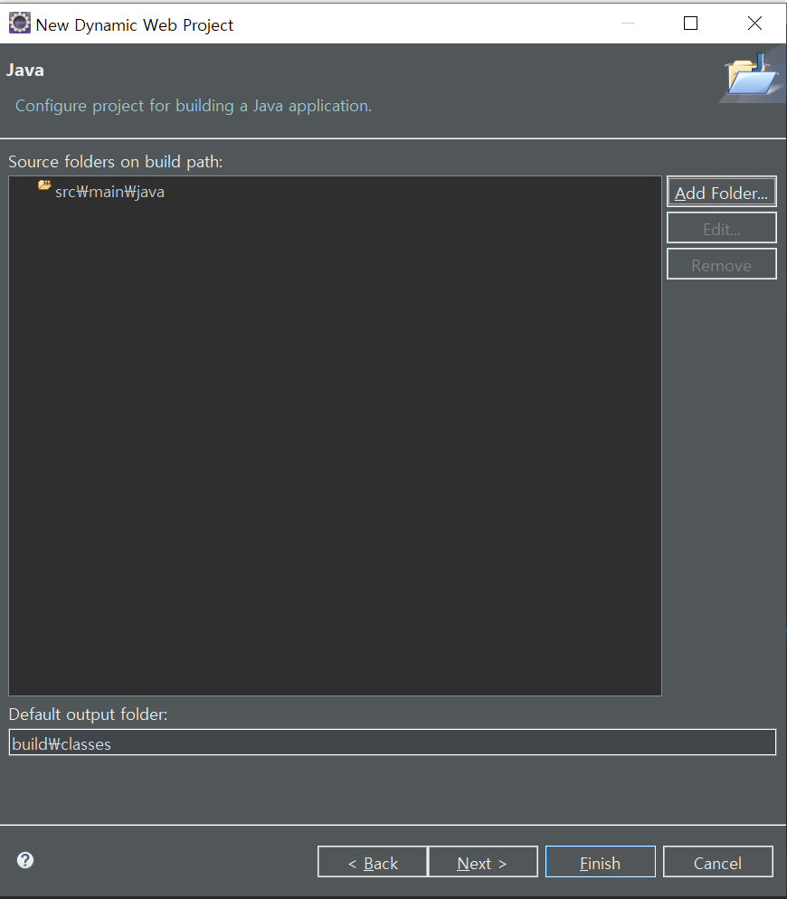

# Create Project
Create Project : File > New > Dynamic Web Project
 
Project name : example-spring-myportal

    
        
    
    
        
    
    
Remove "src" and add "src\main\java"

    
        
    
    
Change Content Diretory to "webapp" and check Generate web.xml...

